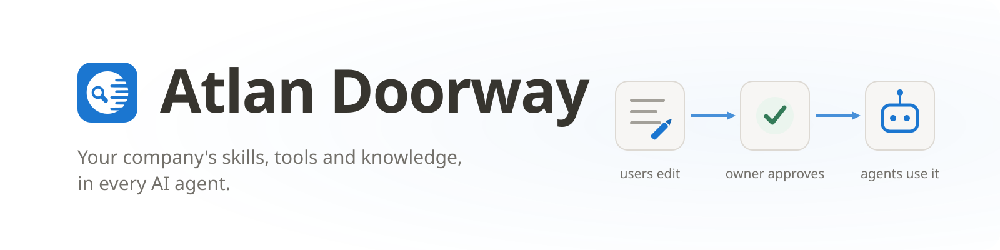

  

**Atlan Doorway is a git-backed control plane for AI-agent skills, tools,
context, permissions and identity. Self-hosted and MCP-native.**

One place where a company's AI skills, tool manuals and knowledge live —
centrally managed, reviewed and access-controlled, and usable from **any AI
agent** that speaks MCP.

This is a private repository. It's the code, not a public project — see
below for what it does and how to try the live instance.

---

## Try it

A running instance is live at **https://atlan-doorway.onrender.com/**.

---

## What it does

**Skills and tools as reviewable files.** Every skill, tool manual and
permission is a file in a git repository you own. The audit trail is the
storage layer: who changed what, when, who approved it, and how to undo it.

**Bidirectional, not a gateway.** MCP gateways only let people consume. In
Doorway anyone can propose a change; on protected branches it reaches the
owners of the files it touches and ships only once they approve. Agents
propose too — one that hits a broken skill mid-task can suggest the fix, and
a person decides whether it lands.

**Per-file access control.** An agent can only do what the person running it
can do, resolved per file, and it never holds the credentials it uses.
Secrets live in an encrypted vault and are injected at call time.

**Any MCP client.** Claude Code, Claude Desktop, Codex, Cursor, Cline and
ChatGPT all connect over MCP with OAuth 2.1, each seeing only what its user's
role allows.

**Context that does not flood the window.** Agents look skills up rather than
loading them all: `list_skills` and `search` narrow the field, `get_skill`
returns one skill at call time.

**Sign-in.** Doorway speaks standard OIDC, so signing in with Google
Workspace, Entra, Okta, Auth0 or Keycloak works as configuration, not code.

---

## Repository layout

| Path | What it is |
| --- | --- |
| `packages/shared` | `@atlan-doorway/platform-shared`: shared types + pure domain utilities |
| `packages/core-backend` | `@atlan-doorway/platform-core-backend`: the core backend (ships `migrations/` + `kb-template/`) |
| `packages/core-frontend` | `@atlan-doorway/platform-core-frontend`: the core UI, published as raw TS/TSX source |
| `packages/doorway-mcp` | `@atlan-doorway/doorway-mcp`: the MCP server and CLI |
| `packages/mcp-core` | `@atlan-doorway/platform-mcp-core`: shared MCP plumbing |
| `apps/server` | standalone core backend shell |
| `apps/web` | standalone core SPA shell (Vite) |

## FAQ

<b>How does an agent know what is in the knowledge base?</b>

Every MCP session starts with instructions: a fixed platform header that says
what Doorway is and to search the knowledge base before answering from memory,
followed by `mcp-description.md` from the root of your repository, where an
admin describes what the knowledge base holds and when to consult it.

<b>How is the catalogue versioned?</b>

By git: every save is a commit, so history, blame and revert work as they do
for code, and changes to protected branches ship as reviewable change requests.

<b>What governance do we get?</b>

Per-file access control, review-gated change requests, and a git audit trail
of who changed what and who approved it.

License: [Apache-2.0](LICENSE)
